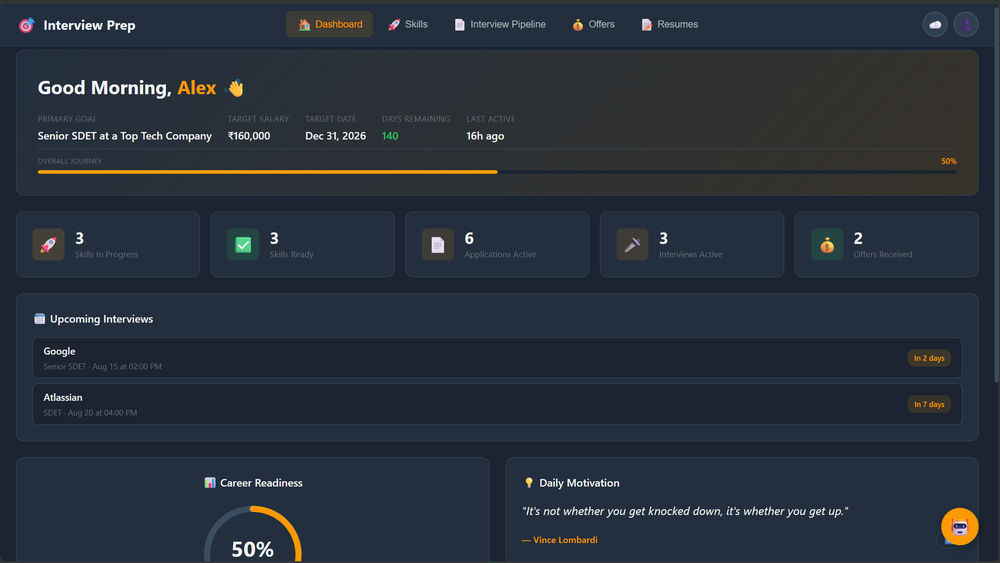
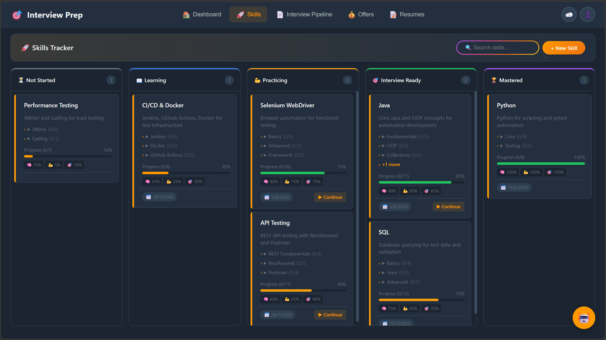
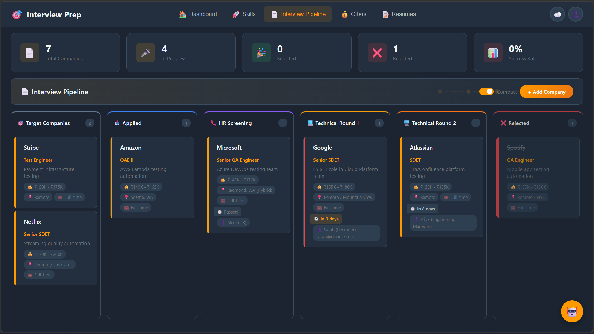
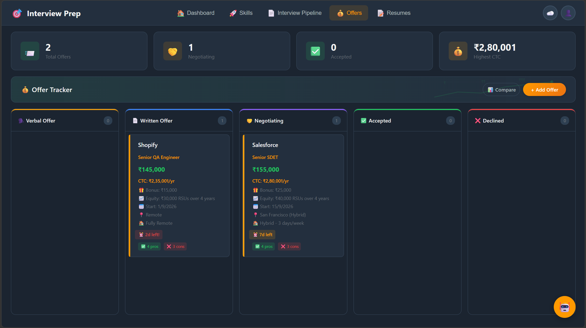
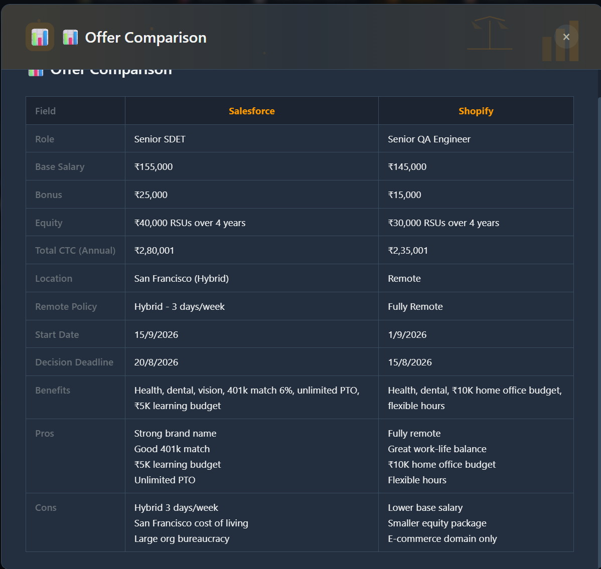
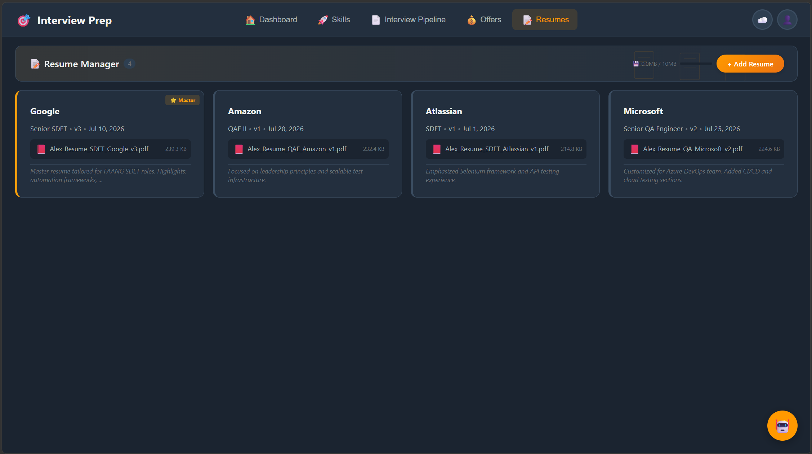
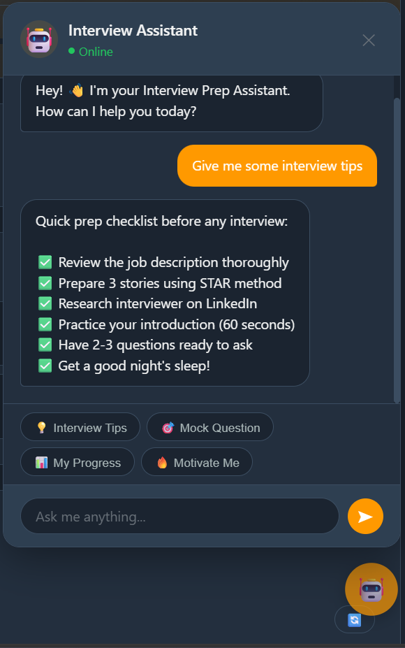
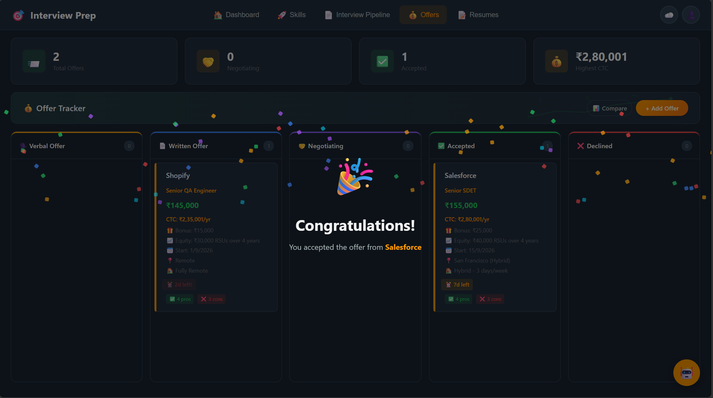

# Interview Prep Dashboard

A comprehensive career tracking dashboard that helps you manage your entire interview journey — from skill building to offer acceptance.

Built with vanilla HTML, CSS, and JavaScript. No frameworks, no dependencies, no backend. Runs entirely in your browser.

---

## Screenshots

### Dashboard


### Skills Tracker


### Interview Pipeline


### Offers


### Offer Comparison


### Resumes


### AI Interview Assistant


### Celebrations


---

## Features

### Dashboard
- Personalized greeting with career goal overview
- Career readiness score (circular progress indicator)
- Quick metrics: Skills ready, Applications active, Offers received
- Upcoming interviews countdown with direct navigation
- Daily motivation quotes (auto-rotating)
- Today's Focus widget with actionable "Go" links that highlight specific cards
- Last activity timestamp

### Skills Tracker
- Kanban board with 5 stages: Not Started → Learning → Practicing → Interview Ready → Mastered
- **Auto-suggest skill templates** — type "Java", "Selenium", "API Testing" etc. to load predefined topics with subtopics (28 skills available)
- **Subtopic completion tracking** with checkboxes — progress auto-calculated
- Expand/collapse topics directly on cards
- "Continue Learning" button linking to your first resource
- Color-coded column headers
- Search/filter skills
- Drag-and-drop between stages

### Interview Pipeline
- Kanban board with 9 stages: Target → Applied → HR Screening → Technical 1 & 2 → Manager → Final → Selected → Rejected
- **Compact mode** (toggle) hides empty columns
- Summary metrics: Total companies, In progress, Selected, Rejected, Success rate %
- Interview countdown badges (today, tomorrow, this week)
- **Round feedback log** — record interviewer name, star rating, and notes per round
- Stage history tracking (auto-recorded on drag)
- Resume linking per company
- Celebration animation when moved to "Selected" + prompt to create offer
- Company name auto-suggest (150+ companies)
- Duplicate prevention

### Offer Tracker
- Kanban board: Verbal → Written → Negotiating → Accepted → Declined
- Total CTC calculation (Base + Bonus + Equity/4)
- Deadline urgency badges
- Pros/Cons tracking
- Side-by-side offer comparison table
- Celebration with confetti on acceptance
- Summary metrics: Total offers, Negotiating, Accepted, Highest CTC

### Resume Manager
- Upload and store PDF/DOC/DOCX resumes (up to 10MB per file)
- Company-organized card grid with colored status borders
- PDF preview in-app with dark mode toggle
- Duplicate resume feature
- Master/template resume marking
- Linked interviews display
- Storage usage indicator
- Download and file management

### AI Interview Assistant (Chatbot)
- Floating chat button with slide-out panel
- Pre-programmed responses for:
  - Interview tips and strategies
  - Mock interview questions (behavioral, technical, system design)
  - Live progress summary from your actual data
  - Salary negotiation advice
  - Interview anxiety management
  - Motivational messages
- Quick action buttons for common queries
- Typing indicator for realistic feel

### Themes
14 themes including:

| Theme | Style |
|-------|-------|
| Discord | Dark charcoal + blurple |
| Notion | Clean white minimal |
| Spotify | True black + green |
| GitHub | Navy + soft blue |
| Linear | Near-black + purple |
| Vercel | Pure black + white |
| Figma | Light gray + purple |
| Slack | Dark gray + cyan |
| X (Twitter) | Navy + Twitter blue |
| VS Code | Developer dark |
| AWS Docs | Navy + orange |
| Sunrise Office | Warm gradient (SVG background) |
| City Night | Blue skyline (SVG background) |
| Focus Mode | Tech grid (SVG background) |
| Coffee Shop | Warm brown (SVG background) |

Press `T` or click the theme button to cycle through themes.

### Other Features
- Keyboard shortcuts (1-5 for tabs, N for new, T for theme, Ctrl+K for search)
- Global search across all tabs
- Export/Import data (JSON)
- Data reset with double confirmation
- Undo delete (10 second window)
- Drag-and-drop cards between columns
- Responsive design (desktop, tablet, mobile)
- Fully offline — no internet required

---

## Getting Started

### Run Locally

No build step needed. Just open the file:

```bash
# Clone the repository
git clone https://github.com/MdSulthan/Interview-Dashboard.git

# Open in browser
cd Interview-Dashboard
open index.html
# or simply double-click index.html
```

Or serve it locally:

```bash
# Using Python
python -m http.server 8080

# Using Node.js
npx serve .
```

Then visit `http://localhost:8080`

### Deploy to GitHub Pages

1. Push to GitHub
2. Go to Settings → Pages
3. Source: Deploy from branch `main` / `/ (root)`
4. Access at: `https://MdSulthan.github.io/Interview-Dashboard/`

---

## Project Structure

```
Interview-Dashboard/
├── index.html              # Main HTML (single page)
├── README.md               # Project documentation
├── css/
│   ├── styles.css          # Base styles, variables, components
│   ├── dashboard.css       # Dashboard widgets, metrics, resume cards
│   ├── kanban.css          # Kanban board, columns, cards
│   ├── responsive.css      # Breakpoints for mobile/tablet
│   └── chatbot.css         # AI assistant chat panel
├── js/
│   ├── app.js              # Main controller, themes, navigation, utilities
│   ├── storage.js          # LocalStorage abstraction layer
│   ├── analytics.js        # Career readiness calculations
│   ├── goals.js            # Dashboard widgets rendering
│   ├── skills.js           # Skills kanban + auto-suggest + progress
│   ├── interviews.js       # Interview pipeline + feedback + summary
│   ├── offers.js           # Offer tracking + comparison + celebration
│   ├── resumes.js          # Resume upload, preview, management
│   └── chatbot.js          # AI assistant responses
├── data/
│   ├── sampleData.js       # Seed data, column definitions, quotes
│   ├── skillTemplates.js   # 28 skill templates with topics/subtopics
│   └── companyData.js      # 150+ company names for auto-suggest
└── assets/
    ├── bg-sunrise.svg      # Theme background
    ├── bg-citynight.svg    # Theme background
    ├── bg-focus.svg        # Theme background
    ├── bg-coffee.svg       # Theme background
    └── screenshots/        # README screenshots
        ├── dashboard.png
        ├── skills.png
        ├── interview-pipeline.png
        ├── offers.png
        ├── offer-comparison.png
        ├── resumes.png
        ├── chatbot.png
        └── celebrations.png
```

---

## Keyboard Shortcuts

| Shortcut | Action |
|----------|--------|
| `1` - `5` | Switch tabs (Dashboard, Skills, Pipeline, Offers, Resumes) |
| `N` | Create new item in current tab |
| `T` | Cycle theme |
| `Ctrl+K` / `Cmd+K` | Global search |
| `Esc` | Close modal / search |

---

## Data Storage

All data is stored in your browser's `localStorage`. Data stays on your device — nothing is sent to any server.

- **Export:** Profile → 📤 Export (saves JSON file)
- **Import:** Profile → 📥 Import (load from JSON file)
- **Reset:** Profile → 🗑️ Reset (double confirmation required)

To transfer data between devices, use Export on one device and Import on another.

---

## Skill Templates Available

28 pre-built skill templates with topics and subtopics:

**Testing & QA:** Manual Testing, Selenium, Cypress, Playwright, Appium, API Testing, Performance Testing, Security Testing, TestNG, Cucumber/BDD, Karate Framework, Mobile Testing (Manual)

**Programming:** Java, JavaScript, Python, TypeScript, SQL, Data Structures & Algorithms

**DevOps & Cloud:** CI/CD & DevOps, Git, Docker/Kubernetes, AWS, Linux/Shell Scripting

**Architecture & Process:** System Design, Agile & Scrum, Test Strategy & Planning

**Data:** MongoDB/NoSQL, Kafka/Message Queues

---

## Browser Compatibility

- Chrome 90+ (recommended)
- Firefox 88+
- Edge 90+
- Safari 14+

---

## License

MIT

---

## Author

Built by [Md Sulthan](https://github.com/MdSulthan)
